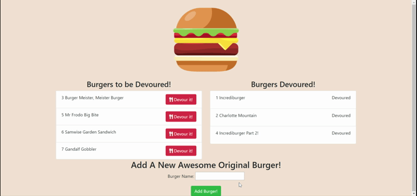

# Burger Devourer!

- URL: https://peaceful-mesa-75820.herokuapp.com/

- GitHub Repo: https://github.com/Samwise2980/burger

## Description

A full stack web app that lets you enter burgers to eat and then devour them. All uneaten burgers appear on the left side of the page including it's own id. When you click the Devour button, then it will move to the right side of the screen and display a 'devoured' text next to it.

## Table of Contents
- [Features](#features)
- [Usage](#usage)
- [Tests](#tests)
- [Questions](#questions)

## Features

- Submiting a burger form
- Seeing the burger appear on the left side of the screen
- Shiny button to devour the burger.
- Devoured burgers appear on the right side of the screen

## Usage

When you first hit the landing page there will be a list of burgers to be devoured on the left and a list of devoured burgers on the right. You should see a burger name field on the bottom of the page. When you are done typing a burger name, click "Add Burger!" This will add a burger to the left list to be devoured. Just click the devour button and it will move to the right side of the screen.

## Tests

There is a provided seeds.sql file in the db folder that will help you populate the schema.sql file tables. Included are three burger names.

## Questions

If you have any questions please contact me at:

Email: samuelfoster0@gmail.com

